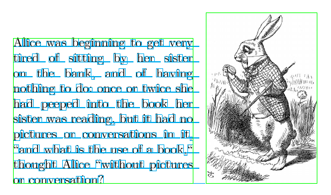
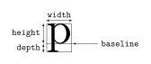
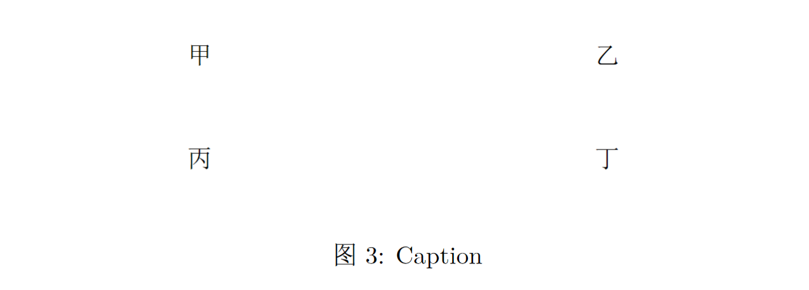
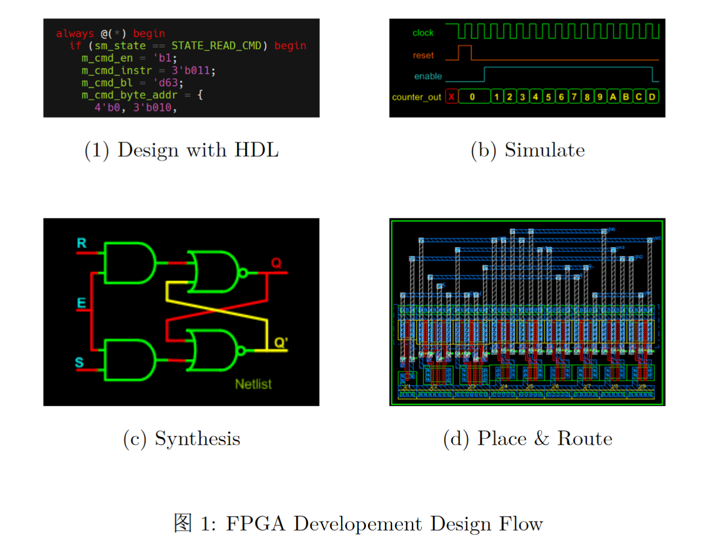
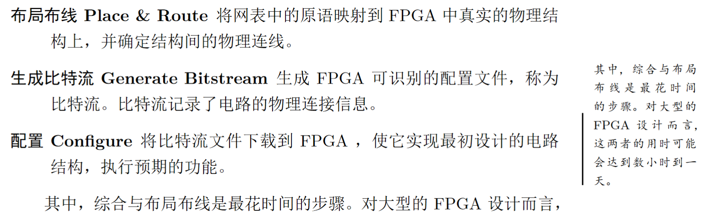
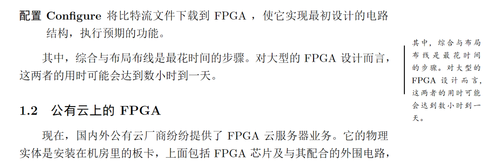
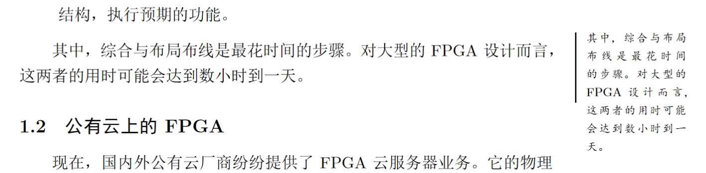
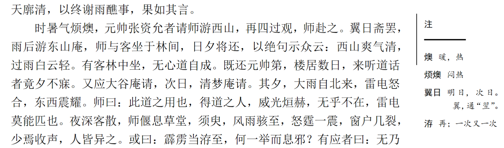

---
title: 使用 TeX 盒子的两个例子
date: 2021-04-04 13:10:00
tags:
  - LaTeX
---


最近要实现几个效果装饰自己的LaTeX文档，决定自己用 TeX 的盒子实现这些效果，顺便也从盒子入手探索一下纯 TeX 的世界。因为发现少有人编写使用 TeX 盒子的实际例子或入门指导，所以在捣鼓出来这两个东西之后想与大家一起分享，起到抛砖引玉的作用。

你可能经常听到这三个词——Tex、Plain Tex、LaTeX，它们之间的区别联系[已经有人讲得很清楚了](https://tex.stackexchange.com/questions/97520/what-is-plain-tex)。<!--LaTeX 构筑在 Plain TeX 的基础之上，而 Plain TeX 又基于 TeX。-->简单来说，TeX 只定义了最最基础的“原语”，而 Plain TeX 基于TeX的原语定义了方便日常使用的宏，LaTeX 则在 Plain TeX 基础上更进一步。大多数声称只使用 TeX 的人，实际上会使用不少 Plain TeX 中的宏。不过在这篇文章里，我是仅仅使用 TeX 的原语来创建盒子的。

<!--more--> 

在列出两个实际例子之前，先来看看 TeX 中的盒子是一个怎样的概念。

## TeX 盒模型

TeX引擎输出文档时会将文档内容转换为很多“盒子”（Box，也有文档翻译成“箱子”）。也就是说，你的文档是由很多层层嵌套的盒子组成的。



TeX使用三个值确定盒子的尺寸：高度(height)、深度(depth)，以及宽度(width)。盒子被基线分为上下两部分，高于基线的部分使用高度度量，低于基线的部分使用深度度量。基线同时也是水平排布的盒子间对齐的参考。



可以使用 TeX 中的命令手动生成盒子：

> -   `\hbox`： 构造一个水平盒子。
> -   `\vbox`： 构造一个竖直盒子，其参考点（reference point）是最后一个元素。
> -   `\vtop`： 构造一个竖直盒子，其参考点是第一个元素。
> -   `\vcenter`： 构造一个在竖直方向于数学轴（math axis）居中的竖直盒子；该命令仅在数学模式下使用。
> -   `\vsplit`： 将竖直盒子顶部部分分离。
> -   `\hsize`： 该命令表示在水平盒子内文本排版可用的行宽。
> -   `\vsize`： 该命令表示页盒子（page box）的高度。
> -   `\raise` `\lower`： 这两个命令用于在水平模式中调整盒子的垂直位置。
> -   `\moveleft` `\moveright`： 这两个命令用于在竖直模式中调整盒子的水平位置。

具体的用法可以参考 *[TeX by Topic](https://texdoc.org/serve/TeXbyTopic.pdf/0)*([译](https://liam.page/2018/05/21/TeX-by-Topic-boxes/)) 或者 *The TeX Book*。这里以两个我实际在用的例子，看看这些基础的命令可以带来怎样的效果。


## 第一个例子：并列排布图片

写文章时经常要把多张小的图片并排插入一个浮动体中，已经有无数的文章告诉你怎样使用 `\minipage` 实现这样的效果。但这次我们单纯使用 TeX 的盒子，以“田”字形排列4张图。所以我们应该在浮动体中填入什么呢？
```latex
\begin{figure}
  % stuff something in TeX way...
  \caption{FPGA Developement Design Flow}
\end{figure}
```

首先浮动体的内容作为一个整体应当在视觉上居中。使用`\centering`当然可以，但也可以使用两个伸缩胶（glue）。`\vbox`作为内容主体区域，其前后各有一个伸缩胶`\hfill`。这两个伸缩胶会以相等的比例伸长以填满空白区域，使 `\vbox` 实现视觉上的居中。`\vbox` 创建了一个盒子，它所包含的的盒子会在垂直方向上排列。
```latex
\begin{figure}
  \hfil
  \vbox{ % body container
    ... ...
  }
  \hfil
  \caption{FPGA Developement Design Flow}
\end{figure}
```
> `\hfil`    Equivalent to `\hskip 0cm plus 1fil`.
> `\hskip`    Insert in horizontal mode a glue item.
> `\vbox`  Construct a vertical box with reference point of the last item.


然后构造呈“田”字形的四个格子。

最外层是上面已经创建好的 `\vbox`，里面的盒子在垂直方向上排列。所以在外层的`\vbox`里插入两个 `\hbox` ，这两个 `\hbox` 会在垂直方向上排列，形成“两行”的视觉效果。`\hbox` 包含的盒子总是在水平方向上排列。所以在 `\hbox` 中各自插入两个 `\vbox`，它们水平排列形成“两列”的效果。

同时也把盒子间的边距与盒子的尺寸的调整好。这里在两个 `\vbox` 间插入 `3em` 的铅空（kern），在两个 `\hbox` 间插入自然长度为 `2.6em` 的伸缩胶。使用 `\hsize` 命令为每个 `\vbox` 指定合适的宽度，例如这里使它们均为0.4倍版心宽。

在内层的四个 `\vbox` 中填入一些内容就可以看到“田”字形的效果了。
```latex
\begin{figure}
  \hfil
  \vbox{ % body container
    \hbox{
      \vbox{\hsize 0.4\textwidth \centering 甲}
      \kern 3em
      \vbox{\hsize 0.4\textwidth \centering 乙}
    }
    \vskip 2.6em
    \hbox{
      \vbox{\hsize 0.4\textwidth \centering 丙}
      \kern 3em
      \vbox{\hsize 0.4\textwidth \centering 丁}
    }
    \vskip 1.3em
  }
  \hfil
\end{figure}
```



最后把图片和文字填进去。图片的宽度也可以使用 `\hsize` 来指定，这里设为1.0倍的 `\hsize`

```latex
\vbox{
  \hsize 0.4\textwidth
  \centering
  \includegraphics[width=\hsize]{media/design_flow_hdl.png}
  \vskip 0.3em
  我是图片下方的文字
}
```

最后的效果如下，同时附上完整代码。当然不局限于“田”字形的排列，其它的布局也是同理。



```latex
\begin{figure}
  \hfil
  \vbox{
    \hbox{
      \vbox{ \hsize 0.4\textwidth
        \centering
        \includegraphics[width=\hsize]{media/design_flow_hdl.png}
        \vskip 0.3em
        (1) Design with HDL
      }
      \kern 3em
      \vbox{\hsize 0.4\textwidth
        \centering
        \includegraphics[width=0.4\linewidth]{media/design_flow_sim.png}
        \vskip 0.3em
        (b) Simulate
      }
    }
    \vskip 2.6em
    \hbox{
      \vbox{ \hsize 0.4\textwidth
        \centering
        \includegraphics[width=0.4\linewidth]{media/design_flow_syn.png}
        \vskip 0.3em
        (c) Synthesis
      }
      \kern 3em
      \vbox{\hsize 0.4\textwidth
        \centering
        \includegraphics[width=0.4\linewidth]{media/design_flow_pr.png}
        \vskip 0.3em
        (d) Place \& Route
      }
    }
    \vskip 1.3em
  }
  \hfil
  \caption{FPGA Developement Design Flow}
\end{figure}
```


## 第二个例子：装饰边注

众所周知  `\marginpar` 可以生成边注，但光溜溜的边注风格十分简朴。下面介绍怎样在边注中使用 TeX 盒子来装饰边注——比如在边注的左侧加一根线，并与文字上部对齐。

首先， 怎样绘制那根“线”？可使用标尺盒子 `\rule` 绘制一个矩形：
```latex
\rule[⟨raise⟩]{⟨width⟩}{⟨height⟩}
% raise 是标尺盒子的偏移，height 是标尺盒子的整体高度
% 几乎每个 LaTeX 教程都会讲这个
```
<!-- depth == raise -->

同样地，在一个 `\hbox` 中放置 `\rule` 与 `\vbox` 让两者水平排布。为了美观，别忘了在其间插入一个铅空。
```latex
\marginpar {
  \hbox{
    \rule{0.03cm}{1.6cm}
    \kern 0.1cm
    \vbox{
      \footnotesize \kaishu
      这里是一些内容
    }
  }
}
```
效果好像不太对，为什么是沿底边对齐的？




这涉及到我们在上面没有提到的一个问题： `\vbox` 的参考点是怎样计算的。在 TeX 的正文环境中有两种竖直盒子，分别是 `\vbox` 与 `\vtop` 。竖直盒子的参考点总是落于盒子的左边界上，其宽度是盒子内所有元素的右边界相对参考点向右超出距离的最大值。在竖直方向上，由 `\vbox` 和 `\vtop` 盒子的高度和深度有所不同：`\vbox` 的参考点位于最后一个元素的基线之上，而 `\vtop` 的参考点位于第一个元素的基线之上。一般来说，只要最后一个（第一个）元素是盒子或者标尺（rule），则 \vbox（\vtop）的深度（高度）非零。

在上面的例子中，`\rule` 的基线是下底边，`\vbox` 的基线是最后一行文字的基线，它们在 `\hbox` 中按基线对齐，表现出上图的效果。

现在，我们将`\vbox` 换为 `\vtop` ，`\rule` 的 raise 值也对应修改使之向下偏移。

```latex
\marginpar {
  \hbox{
    \rule[-1.6cm]{0.03cm}{1.6cm}
    \kern 0.1cm
    \vtop{
      这里是一些内容
    }
  }
}
```



效果还是不太对，文字内容从顶部超出去了，为什么？根据上文所讲，`\vtop` 的基线是第一行文字的基线，又因 `\rule` 向下偏移了自身全部的高度，所以`\rule` 的上边界与`\vtop`的第一行文字的基线对齐了。要解决这个问题，可以在 `\vtop` 开始处插入一个伸缩胶使它的高度为零。
```latex
\marginpar {
  \hbox{
    \rule[-1.6cm]{0.03cm}{1.6cm}
    \kern 0.1cm
    \vtop{
      \vskip 0cm  % 仅仅零高度的伸缩胶就可以了
      这里是一些内容
    }
  }
}
```
现在，标尺盒子的上边真正与文字的上边对齐了。



当然还可以玩出其它花样。




---

也许这两个效果完全可以用宏包轻松解决，但基本的TeX盒模型仍然值得了解。当然不仅是盒模型，其它的 TeX 的知识也是可以在上面花时间的，对于 LaTeX 重度用户更是如此。
