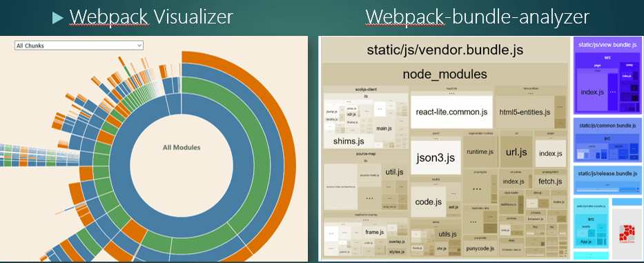
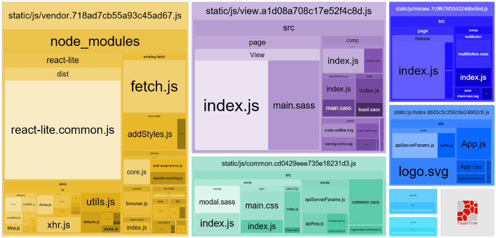
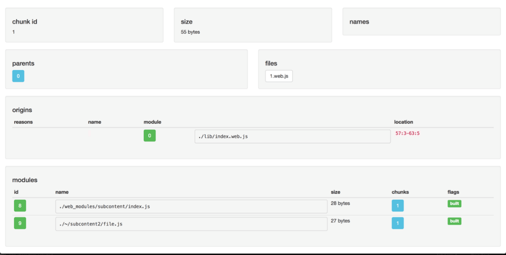
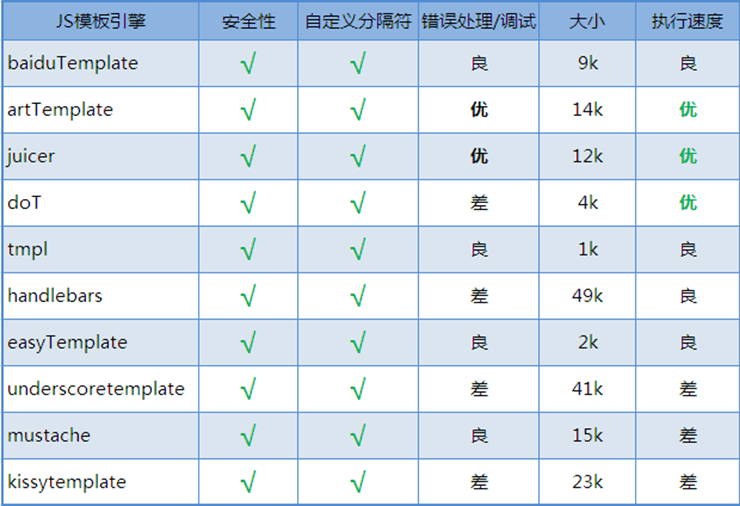
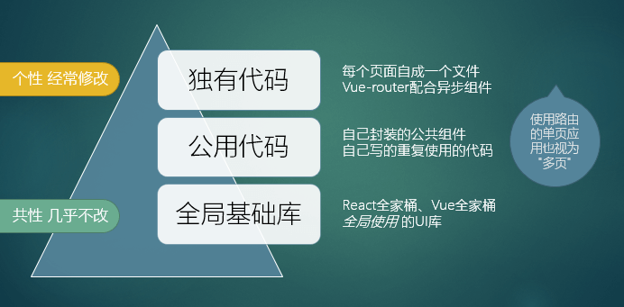
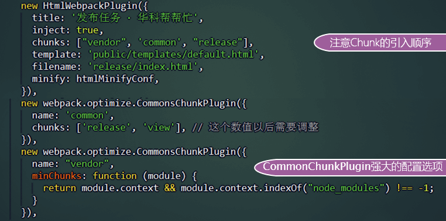

 

# 我们为什么需要加载更快的包

1. 减少首屏加载时间。 在目前国内的网络条件下，通常一个网站，如果“首屏时间”在2秒以内是比较优秀的，5秒以内用户可以接受，10秒以上就不可容忍了。
2. 减小打包体积。 并不是每个地方都有4G（去过东图书库吗）

# 思路

<!--more--> 

# 打包分析工具：找一双好眼睛

## 入门工具

说起 **入门级工具** ，个人感觉比较好用的是“Webpack Visualizer”和“Webpack bundle analyzer”。前者输出环形图，后者是框图，根据自己的喜好选择。很好上手，配置也非常简单，可输出结果为HTML文件。使用这些工具可以很清楚的看到每个bundle分别打包了哪些代码，哪些占据了最大的体积，也可以观察哪些代码其实是无用的可以优化掉的。

比如说下面这张图，我们可以看到vendor文件占了大头，而且axios和fetch两个库功能重复了——这是我之前从来没有注意到的。

## 进阶工具

如果需要 **更详细的分析** ，可以使用Webpack官方出品的在线包分析工具（<http://webpack.github.io/analyse/>）。它提供了更强大的功能：查看模块之间的引用关系、模块关系图（虽然是一团乱麻）、从Module和Chunk等多个个角度进行分析、Assets文件分析。

**【使用指引】**

1. 得到stat.json文件。 stat.json存储了某次打包中详细的信息。所有的分析工具都基这个webpack的功能。
2. 可以使用下面的webpack命令行参数 `webpack --profile --json > compilation-stats.json` 会保存到compilation-stats.json里
3. 上面提到的可视化工具也都提供了生成stat.json的选项。具体参照它们的Github
4. 上传 stat.json 文件
5. 报告生成，好好看一看吧！

**【怎么看报告】**

- 上传你的json文件，长传后会看到这么一个界面，会简单描述你的webpack的版本，有多少modules，多少chunks等等

- 点击chunks，可以看到所有chunks的描述，左边是chunks的id，然后有namse，有多少modules，大小，引用它的chunks是谁、即parents，假如我们需要分析id为1的chunk，只需要点击左边的id

- 这里你可以看到更详细的信息，这里最重要的是两个，reasons是引用这个chunks的模块，modules是这个chunks所引用的modules。也就是模块之间的调用关系。
- 这里你发现有一个模块不是你想要的modules，你只需要点击这个模块的id，再去查看reasons就可以看到这个模块是被谁引入的。
- 也可点击上面的导航来看其他角度的分析。

# 更少的代码

## 选择合适的框架和库

不是每次开发都要Vue或者React的……

- 【Tips】Zepto是迷你版jQuery
- 【Tips】有时候写原生JavaScript也不是一个太差的主意

## 试试JS模板引擎

2012年左右流行的模板引擎虽然在目前被普遍认为是一种被淘汰的技术，但是其数据驱动的思想还是值得我们借鉴的，例如它的思想实现数据逻辑和渲染逻辑的解耦，甚至你自己也可以写一个微型的模板渲染器。

相比主流的的MV*框架，它小巧快速，而这也是这本文所追求的。但是它没有组件的概念，不利于复用和解耦，也不用VirtualDOM技术。所以，简而言之，做一些小规模的、不大变动的数据渲染还是是很合适的。

## 精简版框架

Vue是比较小巧的，而React就不是了。这里推荐两个React精简替代品。我现在使用的是React-Lite，和React的API完美兼容。更换以来到目前也没有遇到什么问题。如果你的项目只是用React常见的API，直接换用React Lite会是个好主意。另一款，Preact，我还没有用过，这里留个坑，以后可以尝试一波。

|          | React Lite                          | Preact          |
| -------- | ----------------------------------- | --------------- |
| API      | 兼容React API                       | 类似React的API  |
| 使用体验 | 前段时间换用 开发环境暂时没发现问题 | 还没用过        |
|          | 去掉不常用的功能（例如服务器渲染）  | 类似React的实现 |

## 删去多余的模块

- 去除不必要的Pollify。包括Babel的配置项和引入的模块（如Promise库、Fetch库）
- 寻找轻量的替代品，不要杀鸡用核弹。问一下自己：现在用的库可以换成更加轻量的吗？
- 避免为使用部分功能而引入整个模块。目前大型UI库、EChart等都提供了部分导入的用法，即只导入自己需要的那一部分而不是导入完整的库。具体用法参考它们的API文档。

## 善用代码分离

代码分离到多个文件会增加HTTP请求的数目和大小，但可以充分利用浏览器的缓存和文件并行下载功能。这不会减小文件体积，却会给用户一种变快了的感觉。只要不是把文件拆得太零碎，利还是大于弊的。

*此处假定你已经会使用CommonChunkPlugin、DLL等插件了。*

### 针对多页应用的三级分割

看到网上两级分割的做法，我提出了另一种策略。

在配置文件里面，你可以像下图这么写，还有些要注意的地方。强烈建议大家好好看看CommonChunk插件的配置选项和官方例子—— **CommonChunk的灵活程度超乎你的想象** 。

### 输出文件名使用 “chunkhash”

[chunkhash]会根据文件内容生成唯一哈希值，而[hash]根据module.id生成

在Webpack不同版本中，可能会遇到仅仅是module.id变化导致chunkhash变化的问题。解决方案是使用插件，参看WP官方文档->指南->缓存。

# 压缩图片

**【位　图】**：最低要求是上线之前顺手TinyPNG，可以很方便的批量上传下载，就是速度慢了点。也有其他的开源图片压缩工具，可以方便对接Webpack，但根据网上大佬的测试，压缩率不如TinyPNG高。

有时间的话，也可以尝试利用TinyPNG提供的接口把图片压缩操作放入生产环境构建过程中，实现build即最小。

**【矢量图】**：单从减小文件体积来说，请多用矢量图，尤其对于大尺寸线条风格icon！在矢量图库里面找一找，或者用大Mac上的Sketch画一个也可以（是的，我就是这么干的）。

不知道有没有设计师小姐姐看到了这段话。

# End

我们的目标是向着更快的包进发！！
