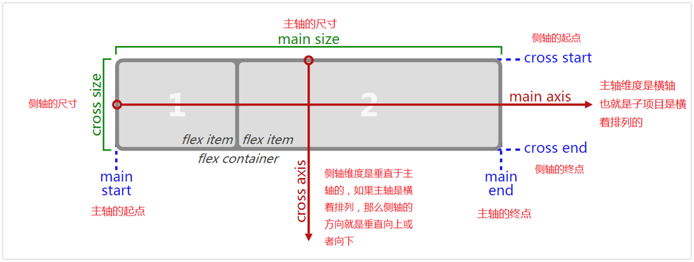
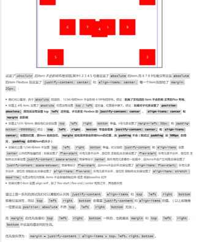
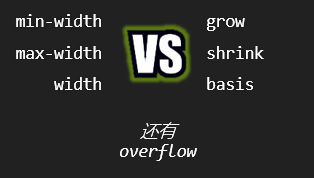
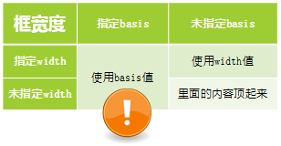
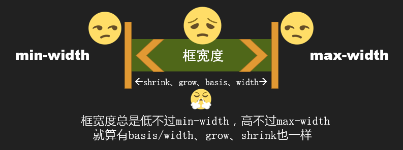

**折腾Flexbox的总结**

**Demo演示文件请移步文末**

# 缘起

说来惭愧，我是在几个星期前因为项目的原因才开始大规模地使用flex布局。flex设计的非常巧妙，背后的原理也比较复杂（看看下面的那张图就知道了）。我找了些网上的资料，自己研究了一下flex布局在各种情况下的表现。对现有的结论做出了验证，自己也有了些新结论。学习CSS这个及其灵活的玩意，我们不仅要懂是什么，还要知道为什么。

<!--more--> 

# 复习

 

### Flex item的尺寸

item-size（尺寸）为主轴方向上item的 content 再加上自身的margin 、 border 和 padding 就是这个 item 的尺寸
注意！**margin也计算在内**！

# 一些会对布局产生重大影响的属性——它们还好用吗

### 令人眼花缭乱的display

这里选择了几个有代表性的属性值：block, inline, inline-block, table-cell, none, flex
虽然现在display的属性值种类繁多，但是在flex里面它们的表现还是很一致的。除了none，自定义的display似乎并不影响flex里面每一元素的表现。
在这里我们可以理解成每一项都是flex-item的框模型，但是要注意的是，这里并没有一个叫做“flex-item”的属性值。

### 正确理解 flex item（flex 子元素）

CSS解析器会把 定义了Flexbox 下的子元素作为一个特殊的的盒子（在这里就叫flex-item吧）。我们可以把flex-item视为盒子的一个种类，而且Flexbox 下的子元素不会管标签本身的默认盒子类型或者是用display指定的类型，统统都是flex-item。

【注意】

CSS没有一个叫flex-item之类的属性，也就是说这种盒子类型是不可被显式指定的。
这和 display:table-* 不一样。如果我们对一个盒子指定了display:table-cell（单元格） ，那么这个盒子周围会自动虚拟出来几个虚拟盒子，常见的是table（表格）和table-row（表格行） 。很明显display:flex和display:table-*在处理盒子的机制上是不同的。

【思考】

我们可以说 “装进” flex-item去吗？
flex子元素本身就会成为flex-item型盒子，无所谓再包一层。网上有些文章是不严谨的。
不过对于没有放在标签里的文本来说……另当别论

### 两种 flex item

我们经常在flexbox下面放置子标签，这样它们就成为了标签节点。不过，我们也可以直接把文字丢到flexbox下面，这样文本成为了一个直属于flexbox的文本节点。这就是两种情况。

**标签节点**：子元素本身会 *成为* 一个flex-item容器
**文本节点**：直接放置在flexbox下面的连续的文本节点会被 *装入* 一个隐形的flex-item中

存在浏览器差异。Edge上把用于代码缩进的Tab、空格放到文本节点里面去了，但是FF和Chrome忽略掉了它们。这种情况，目前还是避免为好（估计也没人会遇上这种情况）

### 将元素剔出文档流的属性：绝对定位、浮动

| 属性     | !                                                            |
| -------- | ------------------------------------------------------------ |
| absolute | 很正常，和传统布局模式中的表现一样。 设置了position:absolute 的flex-item还是被剔出文档流了 |
| float    | 对布局完全完全没有作用（果然如规范所言）                     |
| clear    | float都不管用了，要clear搞什么?                              |

小插曲：

【1】 网上的关于absolute的内容好啰嗦，不就是absolute作用效果仍然很正常么？

 

 

### visibility: hidden & transform

起始这一部分内容根本就不符合小标题“一些会对布局产生重大影响的属性”的题意。我就是为了再次强调一下： **visibility和transform根本就不会对布局产生影响。**

# 指定的各种尺寸——现在表现得怎么样

### 指定基准宽度：width VS. Basis

我们可以理解为basis优先级比width高，有basis就按照basis来指定宽度

#### 【注意】basis独特行为：Basis 和内容自身宽度

**默认情况下**
width： 属性值调整到很小，内容会溢出以保证 框的宽度和属性值一致
basis： 属性值调整到很小，就算宽度到不了指定值也 不允许内容溢出
**但是，设置了 overflow:hidden 之后……**
两个都会把内容隐藏起来，宽度就是我们指定的宽度

#### 【注意】flex-item宽度还是受到shrink和grow制约

**width/basis 不会影响 grow/shrink的行为**
试一试：把一个框的基础宽度调整到很大很大（width/basis都可以）而且不指定flex值，flex-item宽度还是弹性的。因为 “flex” 默认值是 flex: 0 1 auto;，不过我们指定的width/basis会覆盖第三个参数。
可见，即使我们设置了一个大的离谱的宽度，flex-shrink属性仍然运转的很好。
如果显式指定flex-shrink: 0; 框就不会被压缩了。
不妨像这样为一个框设置很小的基础宽度值，试试grow的作用吧。
总之，basis和width不是老大就是了。

**Tips：** flex接受两个简写属性值：none、auto，不过它们都不是flex的默认值。（有人掉坑了么）

### 加上 min-width 和 max-width 看看

框宽度总是低不过min-width，高不过max-width，就算有basis/width、grow、shrink助攻也一样。

Example：

设置grow使第一个框伸展：没伸展过max-width值
设置shrink使第一个框收缩：没收缩低于min-width值
width、basis 也已经失效了

### 优先级顺序

个人感觉这样的思考方式不严谨，但是有助于理解。

# grow、shrink作用下框宽度计算流程——比你想的麻烦一点

**计算基础宽度的时候别忘了把margin算进去。**下面截图里的参考线是针对此调校过的。

### 简单的grow

flex框剩余空间按照grow属性值计算权重，分到每个flex-item框
看看下面的例子。
三个框的grow分别为1、2、3，所以flex框的剩余空间分成6等份，按照权重分配。第一个框分到1份，第二个得到2份，第三个3份。

 

### 带有max-width的grow

\1. 不管max-width先进行一次分配
\2. 分配后，统计那些算出的宽度超出max-width的框，去掉这些框的多余宽度
\3. 又出现了空余空间
\4. 对余出的剩余空间再分配给剩下的框
\5. 如此循环直到分配完成

### 比较复杂的shrink

**注意：flex-shrink 的计算流程和flex-grow的计算流程不同。**

收缩权重 = (flex-item 基础宽度) × (flex-shrink值)
**【!】**计算每个框的收缩权重时不再把shrink属性值直接拿来了

 

带有min-width 的 shrink
\1. 不管min-width先进行一次分配
\2. 分配后，统计那些尺寸已经小于min-width的框，补上这些框欠缺的宽度
\3. 现在尺寸总和又超了
\4. 超标空间再分配给剩下的框
\5. 如此循环，直到所有的框都被塞进去

### 指定了flex-wrap: wrap / wrap-reserve

如果flex-item 的基础尺寸累加超过了flexbox 的尺寸就会另起一行进行排列
这就是nowrap和wrap/wrap-reserve的区别：一行不够了怎么办，压缩flex-item还是另起一行？
所以，对于flex-wrap:wrap/wrap-reserve来说，不会存在 shrink 的情况，而只有 grow 的情况”
当然了，要是一个flex-item实在太长，其基础宽度都超过flexbox本身的宽度了，那还是要看shrink来进行压缩的。也可以说：能换行就换行，真不行再压缩。

下面盗图来说明

# FlexBox好用又方便！

写到这里了，就是这样 :-)

=============

【Demo】 (Link to GitHub)
http://github.com/xuxinhang/explore-flexbox-demo

进一步了探索FlexBox
Flexbox 演习场：https://demos.scotch.io/visual-guide-to-css3-flexbox-flexbox-playground/demos/
